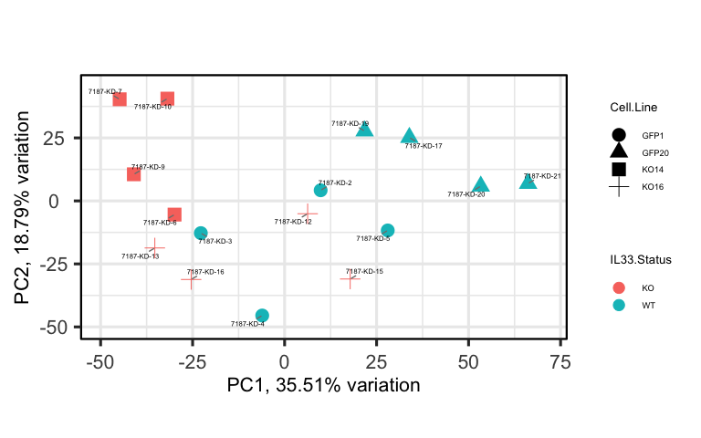
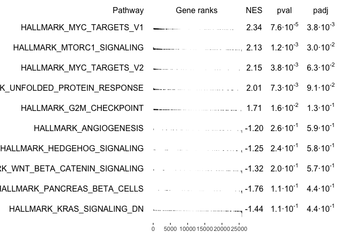

Bulk RNASeq Analysis Pipeline
================

# Table of content

- [Introduction](#introduction)
- [Recommended Readings](#recommended-readings)
- [Setup](#setup)
- [Exploratory Analysis](#exploratory-analysis)
  - [PCA Analysis](#pca-analysis)
  - [Correlation heatmap](#correlation-heatmap)
- [Differential Gene Expression (DGE)
  Analysis](#differential-gene-expression--dge--analysis)
  - [Setting WT as a reference](#setting-wt-as-a-reference)
  - [Removing the intercept and setting up
    contrasts](#removing-the-intercept-and-setting-up-contrasts)
- [Gene Set Enrichment Analysis
  (GSEA)](#gene-set-enrichment-analysis--gsea-)
- [Visualizing Results](#visualizing-results)
  - [Volcano Plot](#volcano-plot)
  - [Plot counts](#plot-counts)
  - [GSEA resutls](#gsea-resutls)
- Pathway Analysis (to be added)
- TF Enrichment Analysis (to be added)
- TIME Analysis (to be added)

# Introduction

This is an analysis pipeline for Bulk RNAseq data. We will re-analyze
the mouse RNAseq data from [Donahue et
al](https://aacrjournals.org/cancerdiscovery/article/14/10/1964/748588/Oncogenic-KRAS-Dependent-Stromal-Interleukin-33).
The data can be downloaded from
[here](https://www.ncbi.nlm.nih.gov/geo/query/acc.cgi?acc=GSE269889)

# Recommended Readings

This tutorial will not include essentials for RNAseq statistics. Your
can read more from the following resources:

- [DESeq2
  Vignette](https://bioconductor.org/packages/devel/bioc/vignettes/DESeq2/inst/doc/DESeq2.html)
- [STAT 555 PSU course](https://online.stat.psu.edu/stat555/node/13/)
- [Design Matrix
  Guidlines](https://bioconductor.org/packages/release/workflows/vignettes/RNAseq123/inst/doc/designmatrices.html)

# Setup

First we will load essential libraries and import the data. Note that we
will need to install the following packages (DESeq2, PCAtools,
EnhancedVolcano, pheatmap, fgsea, msigdbr, decoupleR, ashr)

The goal of this section is to construct a numeric matrix where the rows
represent gene names/ids and the columns represent samples and metadata
dataframe to create DESeq2 object.

``` r
suppressPackageStartupMessages({
  library(DESeq2)
  library(tidyverse)
  library(PCAtools)
  library(fgsea)
  library(msigdbr)
  library(EnhancedVolcano)
  library(pheatmap)
  library(decoupleR)
  library(ashr)
})

## Create output directory
dir.create("outputs", showWarnings = F, recursive = T)

## loading count data
## NOTES: here we will store the gene symbols in a dataframe and keep the gene id as the rowname
## This is because in the count matrix that we have, some genes ids have the same gene symbols
## so we will keep the gene id as rownames to avoid duplicates and add the gene symbols in the end
## for visualization.
ct_mtx <- read.table("data/gene_expected_count.annot.txt", quote = "", header = T, fill = T, sep = "\t")
gene_symbols <- data.frame(gene_symbol = ct_mtx$external_gene_name) %>% `rownames<-`(ct_mtx$gene_id)
ct_mtx <- ct_mtx %>%
  select(-c("entrezgene_id", "external_gene_name", "description")) %>%
  column_to_rownames('gene_id')

## Remove the X in the begining of each sample name and make them match the sample names in metadata file
colnames(ct_mtx) <- gsub("^X", "", colnames(ct_mtx))
colnames(ct_mtx) <- gsub("\\.", "-", colnames(ct_mtx))


## loading metadata
metadata <- read.csv("data/metadata.csv", header = T) %>%
  column_to_rownames('sample')
metadata <- metadata[colnames(ct_mtx),]
## converting the batch info to factor because it is categorical data not numerical
metadata$Batch <- as.factor(metadata$Batch)

# DESeq object all samples ------------------------------------------------
dds <- DESeqDataSetFromMatrix(countData = ct_mtx,
                              colData = metadata,
                              rowData = gene_symbols,
                              design = ~ 1)
```

# Exploratory Analysis

## PCA Analysis

Here we are visualizing the PCA plots for the samples. You can change
the shape and color based on the `color_by` and `shape_by` variables.
You can review [PCAtools
Vignette](https://www.bioconductor.org/packages/devel/bioc/vignettes/PCAtools/inst/doc/PCAtools.html)
to learn how to customize the PCA plot.

``` r
vst <- assay(vst(dds))
rv <- rowVars(vst)
select <- order(rv, decreasing=TRUE)[seq_len(min(2000, length(dds)))]
pca <- pca(vst[select,], metadata = colData(dds))
color_by <- 'IL33.Status'
shape_by <- 'Cell.Line'
biplot(pca,
       showLoadings = F,
       colby = color_by,
       shape = shape_by,
       labSize = 2, pointSize = 5, drawConnectors = T,
       legendPosition = 'right',
       legendLabSize = 7, legendIconSize = 4, legendTitleSize = 10)
```

<!-- --> \##
Correlation heatmap

You can review this
[tutorial](https://davetang.org/muse/2018/05/15/making-a-heatmap-in-r-with-the-pheatmap-package/)
to learn how to customize the heatmap, including adding column and row
annotations

``` r
ann <- data.frame(KO_status = metadata$IL33.Status,
                  CellLine = metadata$Cell.Line, 
                  row.names = rownames(metadata))
pheatmap(cor(vst), annotation_col = ann, annotation_row = ann)
```

<!-- -->

# Differential Gene Expression (DGE) Analysis

Here we will run the heart of RNAseq analysis. Defining differentially
expressed genes (Up- and down-regulated genes). It is curcial to know
how comparisons you are trying to make and construct the design matrix
accordingly. You can review the guidelines for constructing a design
matrix
[here](https://bioconductor.org/packages/release/workflows/vignettes/RNAseq123/inst/doc/designmatrices.html).

Here we will compare the Il33 KO to WT while accounting for other
variables (Cell.Line, Treatment and batch). This can be conducted using
one of two ways as follows:

1)  Setting WT as a reference, and comparing everything to it

``` r
dds$IL33.Status <- factor(dds$IL33.Status, levels = c('WT', 'KO'))
design(dds) <- model.matrix(~ IL33.Status + Batch + Treatment, data = colData(dds))
dds <- DESeq(dds, quiet = T)

## We can check the coefficients for different contrasts using `resultsNames(dds)`
resultsNames(dds)
```

    ## [1] "Intercept"     "IL33.StatusKO" "Batch2"        "Batch3"       
    ## [5] "Batch4"        "TreatmentNT"

We can see that we can check the effect of being KO using the
coefficient `IL33.StatusKO`

``` r
KO_v_wt <- lfcShrink(dds, coef = 'IL33.StatusKO', type = 'ashr', quiet = T) %>%
  data.frame() %>%
  merge(gene_symbols, by = 0) %>%
  filter(!is.na(padj)) %>%
  rename(gene_id = Row.names) 
```

2)  Removing the intercept and setting up contrasts to compare different
    groups. Read more
    [here](https://www.r-bloggers.com/2024/05/a-guide-to-designs-and-contrasts-in-deseq2/)

``` r
design(dds) <- model.matrix(~ 0 + IL33.Status + Batch + Treatment, data = colData(dds))
dds <- DESeq(dds, quiet = T)

## We can check the coefficients for different contrasts using `resultsNames(dds)`
resultsNames(dds)
```

    ## [1] "IL33.StatusWT" "IL33.StatusKO" "Batch2"        "Batch3"       
    ## [5] "Batch4"        "TreatmentNT"

We can see that here to get the DEGs we have first to specific the
contrast.

``` r
KO_v_wt <- lfcShrink(dds, contrast = list('IL33.StatusKO','IL33.StatusWT'), type = 'ashr', quiet = T) %>%
  data.frame() %>%
  merge(gene_symbols, by = 0) %>%
  filter(!is.na(padj)) %>%
  rename(gene_id = Row.names) 
```

Both approaches should have very similar results. We will save the
results as a csv file

``` r
write.csv(KO_v_wt, "outputs/mouse_il33_v_wt_dge.csv", row.names = F)
head(KO_v_wt)
```

    ##              gene_id    baseMean log2FoldChange     lfcSE     pvalue      padj
    ## 1               egfp   52.404144     0.01835905 0.2511604 0.80139134 0.9979924
    ## 2 ENSMUSG00000000001 7973.141256     0.17936812 0.1905877 0.13272198 0.6359739
    ## 3 ENSMUSG00000000028  425.362690     0.24824921 0.2380886 0.03812011 0.4038640
    ## 4 ENSMUSG00000000031   19.674564     0.22507335 0.5498473 0.03161745 0.3765405
    ## 5 ENSMUSG00000000037  163.227191    -0.11123294 0.1980364 0.33159105 0.8275319
    ## 6 ENSMUSG00000000049    8.329456     0.02685919 0.2313623 0.76173908 0.9979924
    ##   gene_symbol
    ## 1        eGFP
    ## 2       Gnai3
    ## 3       Cdc45
    ## 4         H19
    ## 5       Scml2
    ## 6        Apoh

# Gene Set Enrichment Analysis (GSEA)

Here we will run
(GSEA)\[<https://www.pnas.org/doi/10.1073/pnas.0506580102>\] using
Hallmark pathways from
MSigDB\[<https://www.gsea-msigdb.org/gsea/msigdb/human/collection_details.jsp#H>\].
Pay attention to changing the species to match the species of your data.

``` r
species <- 'Mus musculus'
hallmarks_pathways <- msigdbr(species = species, category = 'H', subcategory = NULL)
hallmarks_pathways <- split(x = hallmarks_pathways$ensembl_gene, f = hallmarks_pathways$gs_name)

# > GSEA ------------------------------------------------------------------

gene_rank <- KO_v_wt %>%
  pull(log2FoldChange) %>%
  `names<-`(KO_v_wt$gene_id) %>%
  sort()

gsea_res <- fgsea(pathways = hallmarks_pathways,
                  stats = gene_rank)
```

    ## Warning in preparePathwaysAndStats(pathways, stats, minSize, maxSize, gseaParam, : There are ties in the preranked stats (4.89% of the list).
    ## The order of those tied genes will be arbitrary, which may produce unexpected results.

``` r
## We will save the results as a csv file
write.csv(gsea_res[,-8], "outputs/mouse_il33_v_wt_gsea.csv", row.names = F)
```

# Visualizing Results

Visualizing results can be done using Volcano plots and checking
normalized expression for specific genes. Here we will use
EnhancedVolcano R package.
[Glimma](https://bioconductor.org/packages/release/bioc/html/Glimma.html)
provides an interactive app for visualising the results of DGE analysis.

## Volcano Plot

``` r
EnhancedVolcano(KO_v_wt,
                lab = KO_v_wt$gene_symbol,
                x = 'log2FoldChange',
                y = 'padj',
                title = 'IL33 KO vs WT',
                subtitle = NULL,
                pCutoff = 0.05,
                FCcutoff = 1,
                pointSize = 2,
                xlim = c(-5, 5),
                ylim = c(0, 20),
                legendLabels = c('NS', 'FDR < 0.05', 'log2FC > 1', 'FDR < 0.05 & log2FC > 1'),
                legendPosition = 'top',
                legendLabSize = 10,
                legendIconSize = 5,
                labSize = 2)
```

<!-- -->

## Plot counts

``` r
gene <- 'Igfbp5'
gene_id <- gene_symbols %>% filter(gene_symbol == gene) %>% rownames()
group <- 'IL33.Status'
plot_df <- plotCounts(dds, gene = gene_id, intgroup = group, returnData = T)
ggplot(plot_df, aes_string(x = group, y = 'count', fill = group)) +
  geom_boxplot() +
  geom_jitter(width = 0.1) +
  labs(title = gene)
```

    ## Warning: `aes_string()` was deprecated in ggplot2 3.0.0.
    ## ℹ Please use tidy evaluation idioms with `aes()`.
    ## ℹ See also `vignette("ggplot2-in-packages")` for more information.
    ## This warning is displayed once every 8 hours.
    ## Call `lifecycle::last_lifecycle_warnings()` to see where this warning was
    ## generated.

<!-- -->

## GSEA resutls

``` r
topPathwaysUp <- gsea_res[NES > 0][head(order(padj), n=5), pathway]
topPathwaysDown <- gsea_res[NES < 0][head(order(padj), n=5), pathway]
topPathways <- c(topPathwaysUp, rev(topPathwaysDown))
plotGseaTable(hallmarks_pathways[topPathways],
              gene_rank,
              gsea_res,
              gseaParam=0.5)
```

<!-- --> We can also
visualize one pathway as follows

``` r
plotEnrichment(hallmarks_pathways$HALLMARK_MYC_TARGETS_V1,
               gene_rank,
               gseaParam=0.5)
```

<!-- -->
